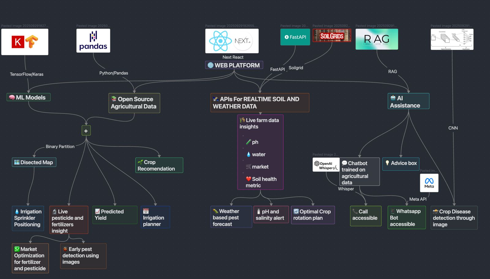

# FarmUP - Al-Powered Crop Yield Prediction and Optimization
[](https://turborepo.com/)
[](https://nextjs.org/)
[](https://www.sanity.io/docs/groq)
[](https://qdrant.tech/)
[](https://www.openstreetmap.org/)
[](https://livekit.io/)


## Overview

FarmUP is an AI-powered platform designed to boost productivity and profitability for small-scale farmers. By
analysing **real-time weather**, **soil metrics**, and **historical data**, our system delivers hyper-local crop yield
predictions and a suite of actionable recommendations through an intuitive mobile and web application.



## Technical Details

### Architecture overview
FarmUp is a TurboRepo monorepo containing three primary services that run concurrently during development:

- Frontend: Next.js (React) — UI, client-side routes, and SSR pages.

- ML / Prediction service: FastAPI — model inference, training endpoints, prediction analysis and batch jobs.

- Backend / Auth: Spring Boot (Java) — user authentication, user/profile data, business APIs and persistence.

The monorepo is orchestrated with Turborepo; start all dev servers with:
```
turbo run dev
```

### Retrieval of data

1. **Weather Summary** (Open-Meteo API)

 - Fetches hourly temperature and humidity
 - Computes average temperature and average humidity
 - Automatically determines season based on the current month
```API: https://api.open-meteo.com/v1/forecast```

2. **Soil pH** (SoilGrids API)

 - Queries SoilGrids v2.0 for the first soil layer
 - Extracts pH value (phh2o) from the top depth
 - Converts SoilGrids pH scale to a standard pH value

```API: https://rest.isric.org/soilgrids/v2.0/properties/query```

3. **Rainfall** (Open-Meteo Archive)

 - Fetches last 30 days of precipitation
 - Sums rainfall to get total water availability
```API: https://archive-api.open-meteo.com/v1/archive```

### Working of the Prediction model

```
# Build model
model = tf.keras.Sequential([
    tf.keras.layers.Dense(64, activation="relu", input_shape=(X.shape[1],)),
    tf.keras.layers.Dropout(0.3),
    tf.keras.layers.Dense(32, activation="relu"),
    tf.keras.layers.Dense(y.shape[1], activation="softmax")
])

model.compile(optimizer="adam",
              loss="categorical_crossentropy",
              metrics=["accuracy"])
```

This is where the model is fed data and model is made to predict the best crop recommendations.

### Geospatial Farm allocator

```
# --------------------
# Recursive BSP Splitter
# --------------------
def recursive_bsp(farm_w, farm_h, crop_alloc, depth=0):
    """Recursive BSP partition based on allocation dictionary."""
    crops = list(crop_alloc.items())
    random.shuffle(crops)
    allocations = []

    def split(x, y, w, h, crops_left):
        if not crops_left:
            return
        if len(crops_left) == 1:
            crop, _ = crops_left[0]
            allocations.append(((x, y, w, h), crop))
            return
        crop, share = crops_left[0]
        total_share = sum(p for _, p in crops_left)
        ratio = share / total_share

        if w > h:  # vertical cut
            split_w = w * ratio
            allocations.append(((x, y, split_w, h), crop))
            split(x + split_w, y, w - split_w, h, crops_left[1:])
        else:      # horizontal cut
            split_h = h * ratio
            allocations.append(((x, y, w, split_h), crop))
            split(x, y + split_h, w, h - split_h, crops_left[1:])

    split(0, 0, farm_w, farm_h, crops)
    return allocations
```

We use BSP splitter to split the farm into the best and most optimal crop recommendations.

### Use Cases

- **Hyper-Local Crop Recommendation**: Predict the most suitable and profitable crops based on real-time weather, soil pH, rainfall, and season.

- **Smart Irrigation & Fertilization**: Provide optimized water, fertilizer, and pesticide recommendations tailored to each farm’s unique conditions.

- **Yield Prediction for Planning**: Help farmers estimate expected yield and plan resources, labor, and market strategies.

- **Farm Resource Optimization**: Suggest optimal farm area division and sprinkler placement using AI.

- **AI Farm Assistant**: Offer instant answers to farming queries using a domain-trained chatbot integrated with real agricultural data.

### Future Enhancements

- **Satellite + Drone Integration**: Add NDVI, crop health monitoring, and pest stress detection.

- **Real-Time IoT Sensor Support**: Soil moisture probes, weather nodes, and automated irrigation controls.

- **Market Price Prediction**: Integrate mandi databases to recommend the best time and place to sell crops.

- **Voice-Based Assistant (Multilingual)**: Hands-free farming assistance in native Indian languages.

- **Farmer Social Network**: Community Q&A, shared best practices, and local group discussions.

- **Offline-First App Architecture**: Ensuring full functionality in rural areas with low connectivity.

### Research Background

#### This system is built on foundational research in:

1. Crop Yield Prediction Models (Time-series + environmental fusion models)
2. Soil & Weather Data Modeling (FAOSTAT, ISRIC SoilGrids, Open-Meteo research)
3. Resource Optimization Using ML
4. Precision Agriculture Technologies
5. Geospatial Data & Farm Mapping (GIS + 3D visualization)
6. AI-powered Agricultural Advisory (RAG-based systems)

```FarmUp integrates these domains into a single hybrid classical ML + geospatial intelligence system.```


